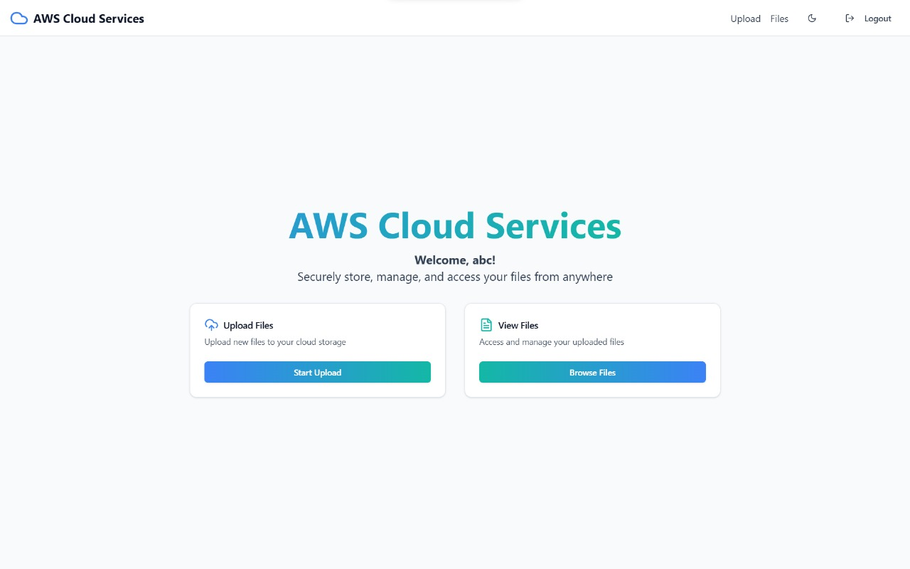
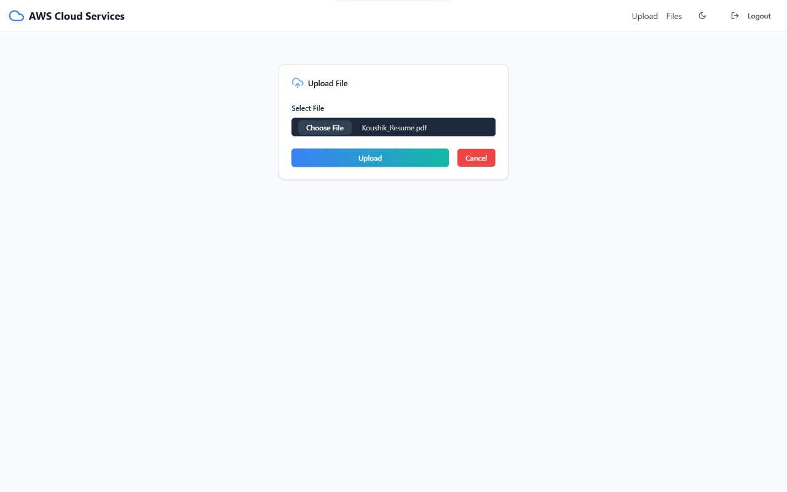
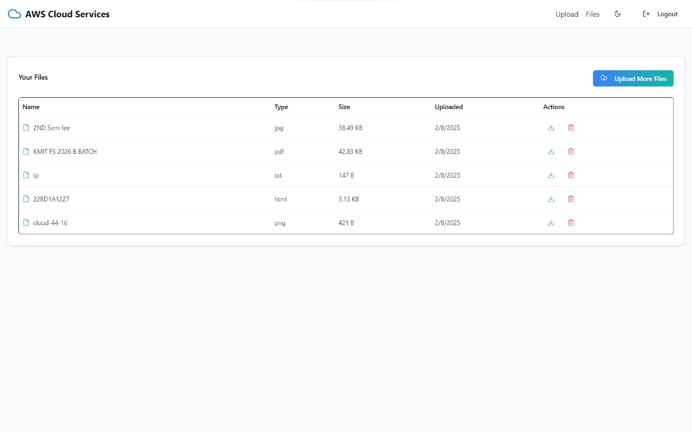

# ☁️ Cloud Storage Web Application

A full-stack web application for secure cloud file storage with unlimited uploads, duplicate file checking, and seamless access from anywhere.

## ✨ Features
### 🎨 Client (Frontend)
- **⚛️ React 19 with Vite** for fast performance.
- **🚏 React Router** for seamless navigation.
- **🎨 Tailwind CSS** for modern UI styling.
- **📡 Axios** for API communication.
- **🔍 Duplicate file detection** before upload.
- **📂 File management options** (upload, view, download, delete).

### ⚙️ Server (Backend)
- **🚀 Node.js with Express** for handling API requests.
- **🗄️ MongoDB with GridFS** for efficient file storage.
- **📥 Multer & GridFS Storage** for handling large files.
- **🔒 Bcrypt** for user authentication and security.
- **🛡️ CORS & dotenv** for secure configuration.

## 📁 Project Structure

### 🖥️ Client (Frontend)
```
client/
│-- public/              # Static files
│-- src/
│   │-- components/      # UI Components
│   │-- pages/           # Page components
│   │-- hooks/           # Custom hooks
│   │-- utils/           # Utility functions
│   │-- main.jsx         # Main entry point
│-- package.json        # Dependencies
│-- vite.config.js      # Vite configuration
```

### 🖥️ Server (Backend)
```
server/
│-- models/             # Mongoose models
│-- routes/             # API routes
│-- controllers/        # Route handlers
│-- middleware/         # Middleware functions
│-- index.js           # Server entry point
│-- package.json       # Dependencies
│-- .env               # Environment variables
```

## 🖼️ Sample Images
### 🏠 Home Page


### 📤 File Upload Page


### 📂 File Management Dashboard


## 🛠️ Installation

### Prerequisites
- Install **Node.js** and **MongoDB** on your system.

### Setup
#### 1. Clone the repository
```sh
git clone https://github.com/kaushik-kadari/CloudServices.git
cd CloudServices
```

#### 2. Set up the backend (server)
```sh
cd server
npm install
```
- Create a `.env` file in the `server` directory with:
```env
MONGO_URI=your_mongodb_connection_string
PORT=5000
```
- Start the server:
```sh
npm start
```

#### 3. Set up the frontend (client)
```sh
cd ../client
npm install
```
- Start the frontend:
```sh
npm run dev
```

## 🚀 Usage
1. Open the client app in your browser (`http://localhost:5173`).
2. Upload, view, and manage your files.
3. The server ensures duplicate file checking before storage.

## 🤝 Contributing
Feel free to submit issues or pull requests to improve this project!

## 📜 License
This project is licensed under the MIT License.

